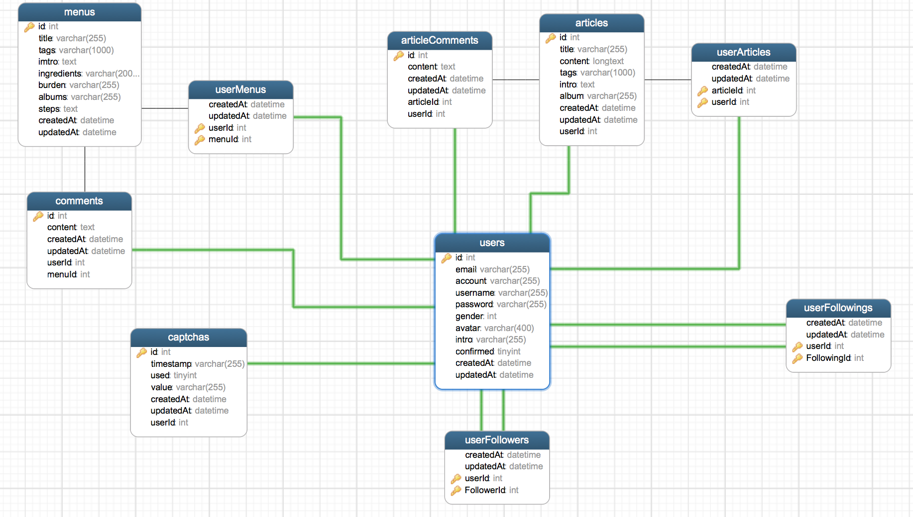

# 小当家

小当家是一个搜索和分享菜谱的 Express Web 应用，旨在打造一个可以在线搜索菜谱和分享菜谱的网站。


## 在线浏览

使用现代浏览器打开 [http://smallmenu.venusworld.cn:3000](http://smallmenu.venusworld.cn:3000) ，推荐使用 Chrome、Safari、IE9 及以上。

## 本地运行

1. 先安装 MySQL，确保 MySQL 运行于 `3306` 默认端口，然后进入 MySQL 新建一个 `smallmenu` 数据库并指定字符集：
  ```sql
  mysql> CREATE DATABASE IF NOT EXISTS smallmenu DEFAULT CHARSET utf8mb4 COLLATE utf8mb4_general_ci;
  Query OK, 1 row affected (0.00 sec)
  mysql> exit;
  Bye
  ```

2. 安装 [Node](https://nodejs.org/en/)，安装好后检查一下安装是否正确
  ```bash
  node -v    # 检查 node 版本
  npm -v     # 检查 npm 版本
  ```
  若出现 `node command not found` 字样，确认已将 node 安装路径添加进环境变量。

3. 确认 MySQL、Node 和 npm 都安装好后，进入项目根目录：
  ```bash
  npm install    # 安装依赖 node_models
  ```

4. 安装好后，在根目录下运行：
  ```bash
  npm start
  ```
  如果没有错误信息的话说明运行成功。

5. 打开浏览器输入：`localhost:3000`即可。

## 数据库设计



数据表含义如下：
1. 用户（users）
  - `id` (int)：用户的唯一标识符，主码
  - `email` (varchar)：用户的注册邮箱
  - `account` (varchar)：用户的账号
  - `username` (varchar)：用户名
  - `password` (varchar)：用户加密过后的密码
  - `gender` (int)：用户性别
  - `avata` (varchar)r：用户头像地址
  - `intro` (varchar)：用户简介
  - `confirmed` (thinyint)：用户是否验证
  - `createdAt` (datetime)：用户创建时间
  - `updatedAt` (datetime)：用户更新时间
2. 菜谱（menus）
  - `id` (int)：菜谱的唯一标识符，主码
  - `title` (varchar)：食谱名
  - `tags` (varchar)：食谱标签
  - `imtro` (text)：食谱简介
  - `ingredients` (varchar)：食谱原料
  - `burden` (varchar)：食谱佐料
  - `albums` (varchar)：食谱封面图像
  - `steps` (text)：食谱步骤
  - `createdAt` (datetime)：创建时间
  - `updatedAt` (datetime)：更新时间
3. 菜谱的评论（comments）
  - `content` (text)：评论内容
  - `userId` ：外键，关联 `users.id` 
  - `menuId` ：外键，关联 `menus.id`
4. 用户收藏的菜谱（userMenus）
  - `userId` ：外键，关联 `users.id` 
  - `menuId` ：外键，关联 `menus.id`
5. 文章（articles）
  - `title` (varchar)：文章标题
  - `content` (longtext)：文章内容
  - `tags` (varchar)：文章标签
  - `intro` (text)：文章简介
  - `album` (varchar)：文章封面图
  - `userId`：外键，关联 `users.id`，文章作者
6. 文章的评论（articleComments）
  - `content` (text)：评论内容
  - `articleId`：外键，关联 `articles.id`
  - `userId`：外键，关联 `users.id`
7. 用户收藏的文章（userArticles）
  - `articleId`：外键，关联 `articles.id`
  - `userId`：外键，关联 `users.id`
8. 用户的关注者（userFollowers）
  - `userId`：外键，关联 `users.id`
  - `FollowerId`：外键，关联 `users.id`
9. 用户关注的人（userFollowing）
  - `userId`：外键，关联 `users.id`
  - `Following`：外键，关联 `users.id`
10. 验证码（captchas）
  - `timestamp` (varchar)：验证码创建时间戳
  - `used` (thinyint)：验证码是否已经使用
  - `value` (varchar)：验证码值
  - `userId`：外键，关联 `users.id`

## 使用到的一些开源库
  - [Bootstrap](http://getbootstrap.com/)
  - [Express](https://expressjs.com/)
  - [SummerNote](https://summernote.org/)
  - [SweetAlert2](https://sweetalert2.github.io/)